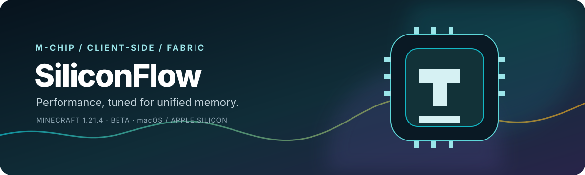

<div align="center">



<p><strong>Apple-Silicon performance for Minecraft.</strong><br>
<span>Frame-time discipline · memory-aware defaults · visual-workload control</span></p>

<p>
  <a href="#installation"></a>
  <a href="#why-siliconflow-optimizes-apple-silicon"></a>
  <a href="#optional-benchmark-and-troubleshooting-methodology"></a>
</p>
<p>
  <a href="https://github.com/chackrahunter/siliconflow"></a>
  <a href="https://github.com/chackrahunter/siliconflow/releases"></a>
  
  
  
</p>
<p>
  
  <a href="https://ko-fi.com/chackrahunter"></a>
  <a href="https://www.paypal.me/Donsko2007"></a>
</p>

<p><strong>High-performance Minecraft optimization for Apple-Silicon Macs.</strong><br>
<sub>Client-side frame pacing, memory discipline, and visual-workload controls for M-series chips.</sub></p>

</div>

<p align="center"><sub>Built for the shared-memory reality of M-series Macs · Minecraft 1.21.4 · Fabric client</sub></p>

> [!IMPORTANT]
> **Beta software, exact target:** SiliconFlow currently builds one version-specific Fabric artifact for **Minecraft 1.21.4**. The dependency target is compile-verified; broader launch compatibility is not implied. It is not a universal JAR. Companion-mod integrations and optional troubleshooting tools are best-effort, and no setting guarantees a particular FPS, frame time, GPU result, or shader result.

<p align="center">
  
</p>

<p align="center"><em>Genuine Minecraft capture from the project. The optional F8 overlay is diagnostic context, not a benchmark result; labels may differ between builds.</em></p>

<p align="center"><sub>Visuals use restrained SVG motion where it explains signal flow. Reduced-motion settings automatically show the same clean static diagrams.</sub></p>

## The short version

<div align="center">

| ◈ **Smoothness** | ◌ **Headroom** | ◇ **Control** |
| :---: | :---: | :---: |
| Frame-time discipline<br><sub>reduce avoidable variance</sub> | Memory-aware behavior<br><sub>respect unified memory</sub> | Visual workload controls<br><sub>choose the trade-off</sub> |

</div>

SiliconFlow is a high-performance boost and optimization mod for Fabric Minecraft on Apple-Silicon Macs with M-series chips. It focuses on practical client-side improvements: steadier frame pacing, conservative memory behavior, reduced rendering overhead, and configurable visual-workload controls. Profiles are bounded and user-owned so you can tune the balance between smoothness, image detail, and system headroom.

The optional F8 overlay and performance recorder were created for development and troubleshooting. They are not the product’s purpose, are not required for normal gameplay, and do not turn SiliconFlow into a tracking or telemetry product.

1. **Install** the exact Minecraft 1.21.4 artifact.
2. **Start** with the `PLAYABLE` profile.
3. **Tune** individual settings only when your workload calls for it.

| If you want to… | Start with… |
| --- | --- |
| Install the exact target build | [Installation](#installation) |
| Understand what the mod owns | [Ownership boundaries](#ownership-boundaries) |
| Inspect a live session | [Optional diagnostics](#optional-developer-and-troubleshooting-tools) |
| Compare two configurations | [Optional benchmark method](#optional-benchmark-and-troubleshooting-methodology) |
| Tune an 8 GB Apple-Silicon Mac | [`docs/max-fps-checklist.md`](docs/max-fps-checklist.md) |
| Use optional diagnostics | [Diagnostics](#optional-developer-and-troubleshooting-tools) |
| Understand version support | [`docs/compatibility.md`](docs/compatibility.md) |

## Why SiliconFlow optimizes Apple Silicon

Minecraft Java on macOS uses an OpenGL path translated onto Metal. Apple Silicon also uses unified memory: the JVM heap, native Minecraft allocations, GPU resources, the compositor, and other applications share one pool. A larger Java heap is therefore not automatically more headroom.

SiliconFlow applies controls that are useful and supportable from the client. It does not pretend to measure GPU utilization, VRAM, or exact core placement when those values are outside its probes; macOS remains authoritative for scheduling and memory pressure.

### Memory policy (mod-owned and reversible)

The memory policy samples JVM heap occupancy and macOS-reported physical free memory asynchronously. It distinguishes heap pressure from shared physical-memory pressure; neither value is VRAM, and neither is an exact accounting of Sodium, Iris, OpenGL/Metal translation, or other native allocations. On three consecutive pressure samples it enters a hysteretic `MOD-OWNED TRIM` state, clears only SiliconFlow scratch state and reduces the mod-owned particle admission budget. It recovers only after twenty healthy samples and a higher free-memory margin, preventing rapid oscillation. It never calls `System.gc()`, changes `-Xmx`, render distance, simulation distance, shader quality, Sodium/Iris settings, or macOS settings. Disable with `memoryPolicyEnabled=false`; diagnostic recording remains separately opt-in.

<p align="center">
  
</p>

*Technical model, not a performance chart. The gentle layer emphasis and moving connectors show that frame-time behavior is a system interaction; with reduced motion enabled, the same model remains fully visible and static.*

## Performance pillars

<div align="center">

|  |  |  |
| :--- | :--- | :--- |
| Bounded pacing and spike-aware behavior intended to reduce avoidable client-side variance. | Conservative defaults and pressure-aware signals for shared-memory Macs. | Optional budgets for particles, entities, overlays, clouds, weather, glints, and related client work. |

</div>

Additional boundaries keep the mod honest:

- **Shader-aware boundaries** — optional reductions do not attempt to replace or patch a shader pipeline.
- **Apple-Silicon-friendly requests** — best-effort Darwin QoS and thread-priority requests where supported; macOS retains scheduling authority.
- **Optional developer tools** — an F8 overlay and bounded JSON recorder for troubleshooting and controlled comparisons; neither is required for normal gameplay.
- **User choice** — profiles and individual settings keep visual and performance trade-offs explicit.

### Profiles

| Profile | Intended use | Character |
| --- | --- | --- |
| `PLAYABLE` | Normal gameplay | Recommended starting point; conservative and reversible |
| `BALANCED` | Heavier scenes | Stronger performance trade-off |
| `MAX` | Difficult workloads | Aggressive visual-cost profile |
| `TELEMETRY` | Investigation | Optional diagnostics-oriented behavior |

A profile is a policy preset, not a guarantee. Start with `PLAYABLE`, change one variable at a time, and compare the same workload.

## Ownership boundaries

SiliconFlow is designed to complement specialized mods instead of replacing their core systems:

| System | Primary owner | SiliconFlow’s boundary |
| --- | --- | --- |
| Terrain rendering, chunk meshes, terrain culling | Sodium | Does not replace the terrain renderer or its mesh pipeline |
| Game-logic optimizations and ticking | Lithium | Does not replace AI, collision, or tick scheduling |
| Memory-structure deduplication | FerriteCore | Does not re-implement its model and blockstate caches |
| Immediate-mode batching | ImmediatelyFast | Does not replace its immediate buffers or HUD batching |
| Shader pipeline | Iris | Treats shader runs as a separate workload; no shader guarantee |
| Scheduling, memory pressure, swap, core placement | macOS | May request QoS; the OS remains authoritative |
| Client-side policy, diagnostics, and selected visual workload | SiliconFlow | Bounded, configurable, and best-effort |

<p align="center">
  
</p>

*Data flow and ownership schematic. The restrained moving connectors indicate policy direction, not throughput or a measured performance chart; reduced-motion settings leave the arrows static.*

## Optional developer and troubleshooting tools

These tools support SiliconFlow development and focused troubleshooting. SiliconFlow is an optimization mod, not a tracking or telemetry product.

### F8 overlay

Press **F8** to toggle the optional overlay. It reports observable signals such as frame-time samples, derived FPS, memory and GC probes, active profile state, and recent spikes. Values SiliconFlow cannot instrument are omitted or marked unavailable rather than invented.

### JSON recorder

When explicitly enabled for troubleshooting, the bounded recorder can write periodic diagnostics to:

```text
<instance>/m3-live-telemetry.json
```

Keep the file with the matching configuration and test notes. It is troubleshooting evidence, not a standardized benchmark format, and it is not required for normal gameplay.

## Exact compatibility

The current artifact is compiled for this exact target:

| Component | Verified target |
| --- | --- |
| Minecraft | **1.21.4 only** |
| Yarn mappings | `1.21.4+build.8` |
| Fabric API | `0.119.4+1.21.4` |
| Fabric Loader | `0.16.14` |
| Java | `21+`; native Apple/aarch64 is recommended on Apple Silicon |
| Platform | Fabric client on macOS / Apple Silicon |

The version detector can report whether the client resembles the target; it cannot make this artifact compatible with another Minecraft release. A different release needs a separately compiled and smoke-tested target. See [`docs/compatibility.md`](docs/compatibility.md) and [`docs/versions/README.md`](docs/versions/README.md).

### Tested companion environment

SiliconFlow can coexist with Sodium, Lithium, FerriteCore, ImmediatelyFast, and Iris. The repository’s tested environment includes Sodium `0.6.13`, Iris `1.8.8`, C2ME `0.3.2`, Lithium `0.15.3`, FerriteCore `7.1.3`, ImmediatelyFast `1.8.7`, ModernFix `5.20.3`, MoreCulling `1.2.10`, Sodium Extra `0.6.1`, Cloth Config, Fabric API, and their dependencies.

That is a test environment, not a universal compatibility promise. Verify optional modules against the exact versions and workload you use. Treat Iris and shader runs separately from unshaded runs.

## Installation

1. Install **Minecraft 1.21.4**, Fabric Loader `0.16.14`, Fabric API `0.119.4`, and Java 21 or newer.
2. Install the SiliconFlow release JAR built for **1.21.4** into the instance’s `mods/` directory.
3. Add companion mods only when their exact versions match the workload you intend to test.
4. Launch the game. SiliconFlow starts with its safe default profile; press **F8** only if you want the optional overlay.
5. Enable recording in the generated configuration only when you need diagnostic evidence.

Do not install this artifact into another Minecraft release and treat a successful file copy as compatibility evidence.

## Configuration

The configuration is stored at:

```text
<instance>/config/m3-frametime.json
```

The configuration owns user intent: active optimization profile, optional F8 overlay, bounded performance recording, spike threshold, optional spike logging, render-thread/Darwin QoS requests, and swap-interval behavior. It does not override the ownership boundaries above.

Keep the file when troubleshooting. Reset it only when release notes or an implementation migration explicitly call for it.

| Need | Guide |
| --- | --- |
| A concise Apple-Silicon checklist | [`docs/max-fps-checklist.md`](docs/max-fps-checklist.md) |
| Conservative Prism guidance for 8 GB systems | [`docs/prism-max-performance.md`](docs/prism-max-performance.md) |
| Boundaries with common performance mods | [`docs/sodium-lithium-gap-analysis.md`](docs/sodium-lithium-gap-analysis.md) |
| Causes, evidence, and repeatable troubleshooting | [`docs/stutter-research.md`](docs/stutter-research.md) |
| Version and integration policy | [`docs/compatibility.md`](docs/compatibility.md) |
| Full Apple-Silicon performance handbook | [`docs/research/apple-silicon-performance-handbook.md`](docs/research/apple-silicon-performance-handbook.md) |

## Optional benchmark and troubleshooting methodology

Benchmarking is optional and exists to help developers and users troubleshoot or compare configuration changes. SiliconFlow makes no universal performance claim. Label a number **measured** only when the raw source and test conditions are available; otherwise label it **illustrative** or **unverified**.

<p align="center">
  
</p>

*Benchmark discipline at a glance. The subtle loop motion reinforces sequence and repeatability, not speed; reduced-motion settings show the complete static loop.*

1. **Record conditions.** Mac model and M-chip generation, RAM, macOS version, Java vendor and architecture, Minecraft/Fabric versions, mod versions, shader state, refresh rate, render/simulation distance, and JVM arguments.
2. **Match the workload.** Create profiles that differ only by SiliconFlow being present or absent. Keep Sodium, Iris, shader pack, resource pack, world, seed, camera route, settings, and background applications identical. If optional mods are tested, keep the same set in both runs.
3. **Warm up and repeat.** Warm up for five minutes, then repeat the same route for at least five runs. Use the F8 overlay or recorder only when optional diagnostic evidence is useful; retain raw output for every run when enabled.
4. **Compare distributions.** Report median and p95/p99 frame time, sample count, run duration, and notable spikes. Treat FPS as a secondary summary, not proof of causality.
5. **Publish the evidence.** Keep the configuration, mod list, and test notes beside any aggregate. Do not infer GPU utilization, VRAM use, or core placement from values SiliconFlow cannot measure.

For practical Apple-Silicon troubleshooting, see [`docs/max-fps-checklist.md`](docs/max-fps-checklist.md) and [`docs/stutter-research.md`](docs/stutter-research.md).

## Troubleshooting first checks

| Symptom | First checks |
| --- | --- |
| Overlay does not appear | Confirm the exact 1.21.4 artifact, launch once, press **F8**, then check the log for mixin or dependency errors. |
| Frequent long freezes | Use native aarch64 Java, watch macOS Memory Pressure, reduce render distance manually, and avoid oversized heaps on 8 GB systems. For the confirmed 8 GB M3 + Iris + 41-chunk near-heap failure, treat the heap ceiling as a user-controlled limit: prefer a native Java 21 runtime and a conservative Prism `-Xmx` (often around 2.5–3G depending on the rest of the modpack), then test; SiliconFlow does not force or rewrite JVM arguments. |
| Chunk-loading hitching with Sodium | Test Sodium’s macOS **Chunk Memory Allocator = `SWAP`** and compare against a documented baseline. |
| Shaders behave differently | Record the exact Iris version, shader pack, driver state, and settings; shader runs are separate and not guaranteed. |
| An optional diagnostic says unavailable | This is expected for signals SiliconFlow does not instrument, including GPU utilization, VRAM, and exact core placement. |
| A configuration change worsens behavior | Restore the previous file or reset only when an upgrade note calls for it; then retest one variable at a time. |

When reporting an issue, include exact Minecraft/Fabric/Java versions, Mac model and RAM, the full mod list, active profile, configuration, log, and optional diagnostic output only if recording was enabled.

## Beta status and limitations

- **Beta:** APIs, profiles, labels, and behavior can change.
- **Exact target:** the currently verified build is for Minecraft 1.21.4 only.
- **Optional tools and integrations:** F8 diagnostics, recording, QoS requests, and companion integrations are best-effort; diagnostics may report unavailable data.
- **OS authority:** macOS controls scheduling, memory pressure, swap, and core placement.
- **Integration boundaries:** Sodium, Iris, shaders, resource packs, drivers, launchers, and other mods can change behavior.
- **Visual trade-offs:** optional reductions can alter particles, overlays, glints, clouds, weather, or distant-entity presentation.
- **No automatic magic:** choose settings deliberately and validate changes against a repeatable workload.

## Build and Prism deployment

```bash
./gradlew build --console=plain -Pprism_instance=1.21.11
```

This compiles the exact `1.21.4` target and deploys the remapped artifact to the named Prism instance. The resulting JAR is written to `build/libs/`. Deployment to a differently versioned instance is not compatibility evidence.

## Support

If SiliconFlow is useful, support continued development here:

<p align="center">
  <a href="https://ko-fi.com/chackrahunter"></a>
  &nbsp;
  <a href="https://www.paypal.me/Donsko2007"></a>
</p>

- [Open an issue](https://github.com/chackrahunter/siliconflow/issues) with your exact setup.
- [Browse releases](https://github.com/chackrahunter/siliconflow/releases).
- [Support on Ko-fi](https://ko-fi.com/chackrahunter) or [donate with PayPal](https://www.paypal.me/Donsko2007).

## License

MIT — see [`LICENSE`](LICENSE).
