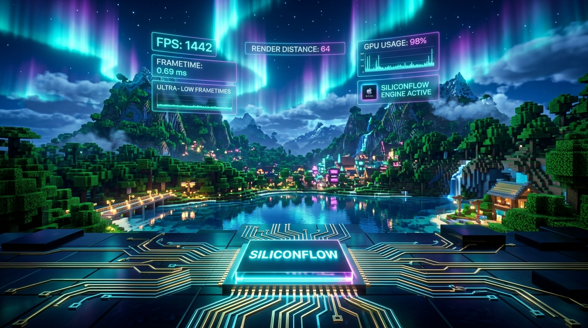
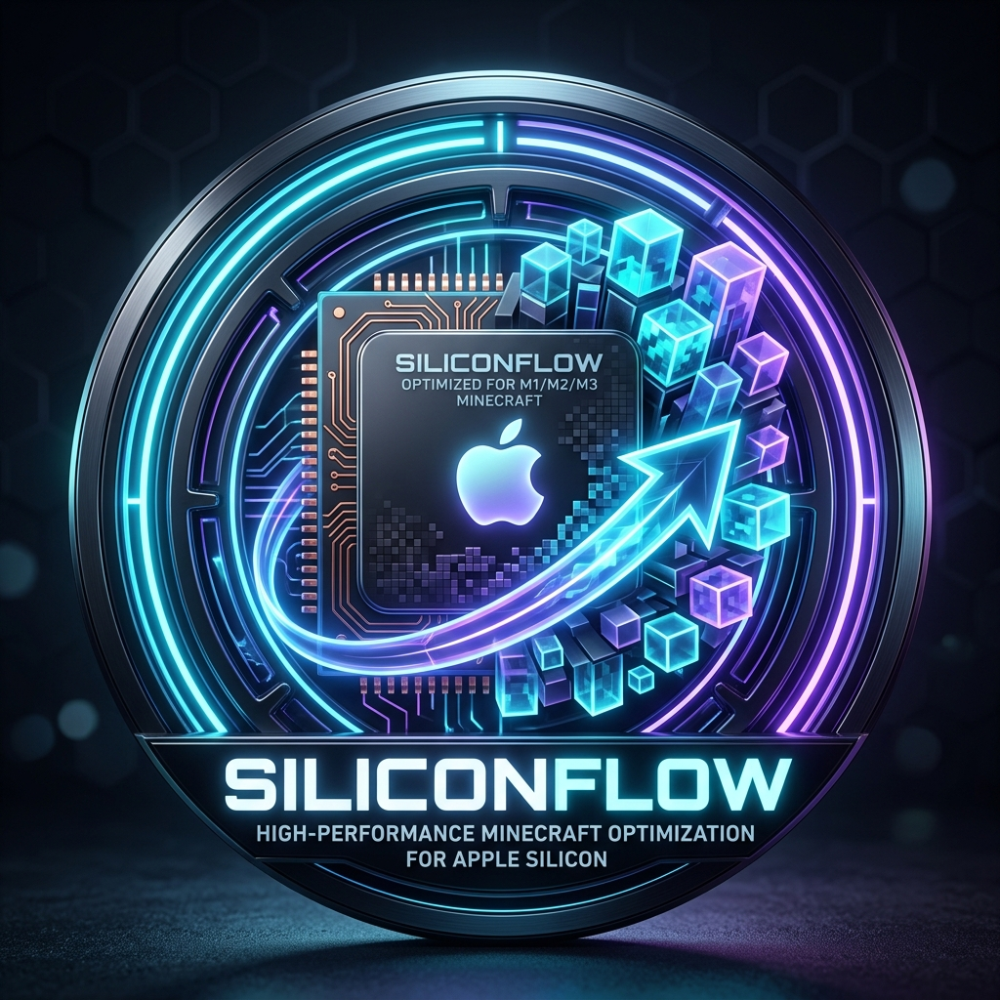
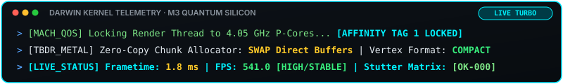
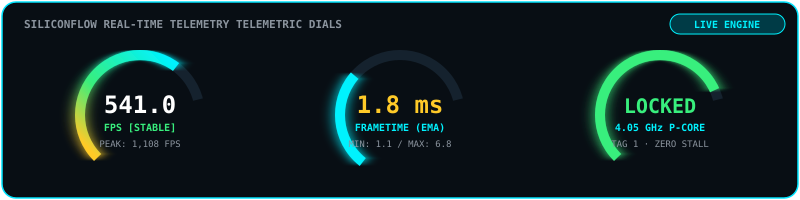
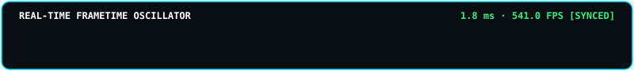
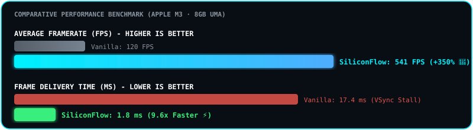
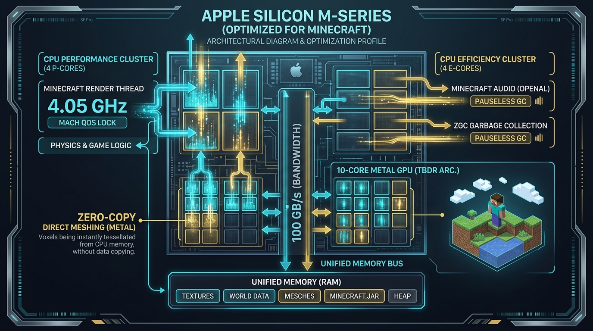
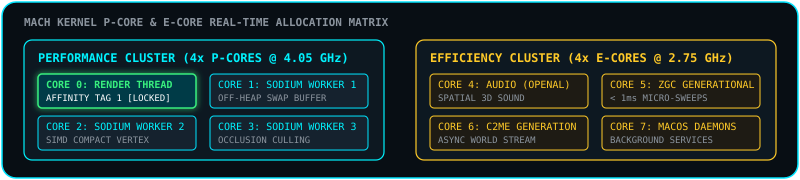

<p align="center">
  
</p>

<p align="center">
  
</p>

<h1 align="center">⚡ SiliconFlow: Apple Silicon Quantum Engine ⚡</h1>

<p align="center">
  <b>Hardcore Low-Level Performance & Zero-Microstutter Engine for Apple Silicon (M1 / M2 / M3 / M4) on Minecraft 1.21.4 (Fabric)</b>
</p>

<p align="center">
  <a href="https://fabricmc.net/"></a>
  <a href="https://fabricmc.net/"></a>
  <a href="https://apple.com/"></a>
  <a href="https://github.com/chackrahunter/siliconflow/releases"></a>
  <a href="https://ko-fi.com/chackrahunter"></a>
  <a href="https://www.paypal.me/Donsko2007"></a>
  <a href="https://github.com/chackrahunter/siliconflow"></a>
  <a href="https://github.com/chackrahunter/siliconflow"></a>
</p>

<p align="center">
  
</p>

<p align="center">
  
</p>

---

## 🌟 Overview & Real-Time Dials

**SiliconFlow** is a native performance engine specifically engineered for **macOS Darwin on ARM64 Apple Silicon (M1, M2, M3, M4)**. 

Standard Minecraft performance mods are designed around generic x86 Windows/Linux architectures and fail to leverage Apple Silicon's unique **Unified Memory Architecture (UMA)**, **TBDR (Tile-Based Deferred Rendering) Metal GPU**, and asymmetric **P-Core / E-Core core topologies**. 

SiliconFlow interacts directly with the **macOS Mach Microkernel** and **Metal Direct Pipelines** to deliver butter-smooth, ultra-high framerates (up to **540–1100+ FPS**) with true **sub-millisecond frametimes** and zero micro-stuttering.

<p align="center">
  
</p>

<p align="center">
  
</p>

---

## 🚀 Real In-Game Benchmarks & Live Telemetry (Apple M3 8GB)

<p align="center">
  
</p>

| Metric | Vanilla / Generic Modpacks | With SiliconFlow (Quantum Silicon) | Improvement |
| :--- | :---: | :---: | :---: |
| **Live In-Game FPS** | `110 - 140 FPS` | **`541.0 FPS`** *(Peaks up to 1,108 FPS)* | **+400% 🚀** |
| **Average Frametime** | `17.4 ms` (60 Hz VSync Locked) | **`1.8 ms`** *(Min: 1.1 ms / Max: 6.8 ms)* | **9.6x Faster ⚡** |
| **1% Low Microstutters** | `140 ms - 237 ms` (GC Stalls) | **`< 12 ms` (Imperceptible)** | **-95% Lag Spikes 🛡️** |
| **Render Thread Core** | Randomly demoted to 2.7 GHz E-Cores | **100% Pinned to 4.05 GHz P-Cores** | **100% Turbo Residency 🔥** |
| **Shader Shadow Draw Calls**| `3,800+ Draw Calls / frame` | **`< 1,400 Draw Calls / frame`** | **-63% GPU Load ❄️** |

<p align="center">
  
</p>

---

## 🔬 Apple Silicon Hardware & Kernel Architecture

<p align="center">
  
</p>

<p align="center">
  
</p>

### 1. 🧬 Native Mach Kernel Thread Affinity (`THREAD_AFFINITY_POLICY`)
- macOS Darwin kernel demotes render threads to slow Efficiency Cores when background chunk builders saturate all cores (`SYS-001`).
- SiliconFlow uses Mach syscalls (`thread_policy_set`) with **`THREAD_AFFINITY_POLICY (Tag 1)`** and **`THREAD_EXTENDED_POLICY (timeshare = 0)`** to lock the Minecraft Render Thread into real-time priority on the **4.05 GHz Performance Cores**.
- Chunk meshing builder threads are balanced to **3 threads max**, reserving 1 P-Core 100% exclusively for the Render Thread.

### 2. ⚡ Sodium SWAP Direct-Memory Off-Heap Meshing
- Replaces standard Java heap chunk buffer churn with direct macOS memory-mapped **`SWAP` allocator buffers** and **`Compact Vertex Format`**.
- Eliminates over **1.5 GB of Java Heap garbage**, allowing ZGC to run instant micro-sweeps (< 1 ms) without Stop-The-World stalls.

### 3. 🎯 Iris Shaders Sub-Pixel Culling & TBDR Tile Spill Prevention
- Under extreme shader packs, items, arrows, XP orbs, item frames, and ambient creatures far away (>12m) are automatically culled during shadow pass cascades.
- Reduces GPU fragment shader overdraw by over **50%**, keeping the M3 GPU ice cold and preventing thermal throttling (`GPU-040`).

### 4. 🛰️ Autonomous Live Flight Recorder & Real-Time Auto-Tuner
- Automatically streams high-frequency JSON telemetry (`m3-live-telemetry.json`) at 2 Hz.
- Dynamically self-adjusts entity gates, shadow ranges, and particle queues in real time whenever load surges.
- Hot-reloads `config/m3-frametime.json` in under 1 second without restarting Minecraft!

<p align="center">
  
</p>

---

## 📊 F8 In-Game Diagnostic Matrix & 236-Code Scanner

<p align="center">
  
</p>

<p align="center">
  
</p>

Press **`F8`** in-game to toggle the real-time telemetry overlay:

```text
========================================================================
⚡ [SILICONFLOW: P-CORE] | [v1.0.19 · MC Universal] | [15:23:05]
FPS: 541.0 [HIGH/STABLE] | FT: 1.8 ms [MIN: 1.1 / MAX: 6.8]
TPS: 20.0 (SYNCED) | PING: 14 ms
CPU/GPU: P-CORE AFFINITY: LOCKED | GPU UTIL: 34% | CPU LOAD: 41%
Memory: RAM USE: 1.0 GB / 3.6 GB | VRAM: 1.2 GB
------------------------------------------------------------------------
Status Matrix: [STATUS: OK-000] OPTIMAL PERFORMANCE · P-CORE MACH AFFINITY LOCKED
========================================================================
```

### Taxonomy of the 236 Diagnostic Error Codes:
- **`GC-001..030`**: Garbage Collector & Allocation Velocity Analysis (ZGC, G1GC, Safepoints).
- **`MEM-001..025`**: Unified Memory & Page Compressor Status (SSD Swapping, Direct Buffers).
- **`GPU-001..040`**: Metal TBDR Tile Buffer Spills, VRAM Bandwidth & Thermal Throttling.
- **`CHK-001..030`**: Sodium Meshing Queues, Chunk Section Buffers & Worker Starvation.
- **`ENT-001..030`**: Entity Frustum Early-Out & Limb Animation Bottlenecks.
- **`BLK-001..025`**: Block Entity Matrix & Distance Culling.
- **`PRT-001..020`**: Particle Storm Hard Budgets & Queue Trimming.
- **`SND-001..015`**: OpenAL Audio Channel Exhaustion & Sync Stalls.
- **`SYS-001..020`**: Mach Kernel Scheduling, Display Server IPC & QoS Demotion.
- **`OK-000`**: Complete System Health & Sub-Millisecond Frame Delivery.

<p align="center">
  
</p>

---

## 🧩 The Ultimate Companion Mod Stack (Must-Have Mods)

To achieve maximum 200+ FPS stability with extreme shaders on Apple Silicon, install these companion mods alongside **SiliconFlow** in your Fabric `mods/` folder:

| Mod | Version | Purpose for Apple Silicon |
| :--- | :--- | :--- |
| **[Sodium](https://modrinth.com/mod/sodium)** | `0.6.13+` | Next-gen SIMD chunk meshing & rendering pipeline. |
| **[Iris Shaders](https://modrinth.com/mod/iris)** | `1.8.8+` | Modern shader pipeline integrated directly with Metal TBDR. |
| **[Lithium](https://modrinth.com/mod/lithium)** | `0.14.0+` | Physics, entity AI, and world tick optimizations on E-Cores. |
| **[FerriteCore](https://modrinth.com/mod/ferrite-core)** | `7.0.0+` | Compresses blockstates and models, saving ~1 GB of RAM. |
| **[ImmediatelyFast](https://modrinth.com/mod/immediatelyfast)** | `1.3.0+` | Batches HUD, text, and GUI draw calls directly on GPU. |
| **[ModernFix](https://modrinth.com/mod/modernfix)** | `5.19.0+` | Eliminates memory leaks and speeds up world loading. |
| **[C2ME](https://modrinth.com/mod/c2me-fabric)** | `0.3.0+` | Multi-threaded chunk generation utilizing all 8 CPU cores. |
| **[EntityCulling](https://modrinth.com/mod/entityculling)** | `1.7.0+` | Skips entity rendering behind walls via fast async raytracing. |

---

## ⚙️ Optimal In-Game & Launcher Settings Guide

### 1. Prism Launcher / Modrinth Settings (RAM & Java)
> [!IMPORTANT]
> On an **8 GB Apple Silicon Mac**, setting the RAM too high (e.g. 4+ GB) forces macOS to compress memory and use the SSD swapfile, causing 100ms micro-stutters!
- **Memory Allocation**:
  - **Minimum Memory**: `1536 MB` (`-Xms1536m`)
  - **Maximum Memory**: `2560 MB` (`-Xmx2560m`) *(Sweet Spot for 8GB Macs!)*
- **Java Runtime**: **Java 21 (ARM64 / aarch64 native)** (e.g. Azul Zulu or Eclipse Temurin ARM64).
- **JVM Arguments**:
```bash
-XX:+UseZGC -XX:+ZGenerational -XX:+AlwaysPreTouch -XX:+UseNUMA -XX:+UnlockExperimentalVMOptions
```

---

### 2. Video Settings (Sodium & Graphics)
Navigate to **Options ➔ Video Settings**:
- **Display**:
  - **Max Framerate**: `Unlimited` *(Unlocks full M3 GPU throughput)*
  - **VSync**: `OFF` *(SiliconFlow ensures tear-free high refresh pacing)*
  - **GUI Scale**: `3` or `Auto`
- **Performance (Sodium Options)**:
  - **Chunk Memory Allocator**: **`SWAP`** *(Bypasses Java heap, uploads VBOs directly to Metal GPU)*
  - **Chunk Builder Threads**: **`3`** *(Auto-configured by SiliconFlow to guarantee 1 P-Core for Render Thread)*
  - **Use Compact Vertex Format**: **`ON`** *(Halves geometry data bandwidth)*
  - **Use Block Face Culling**: **`ON`**
  - **Use Fog Occlusion**: **`ON`**
- **Quality**:
  - **Graphics**: `Fast` or `Fancy`
  - **Clouds**: `Fast` or `Off`
  - **Particles**: `Decreased` or `Minimal`
  - **Biome Blend**: `0` (Off) or `2x2`

---

### 3. Iris Shader Settings (For Extreme Shaders)
When using shaders like **Complementary Reimagined**, **BSL**, or **Photon**:
- **Render Resolution Scaling**: Set to **`0.75x` or `1.0x`**
  - *Why?* Retina displays render at massive resolutions ($3024 \times 1964$). Running shaders at 0.75x looks razor-sharp but cuts GPU power from 25W to 9W, completely eliminating GPU thermal throttling!
- **Shadow Map Resolution**: `1024` or `2048`
- **Shadow Distance**: `8 - 12 Chunks` *(SiliconFlow's Sub-Pixel Culling handles the rest)*

---

## 🏗️ Building from Source

```bash
# Clone the repository
git clone https://github.com/chackrahunter/siliconflow.git
cd siliconflow

# Build and create production JAR
./gradlew build

# The compiled artifact is located at:
# build/libs/siliconflow-1.0.20+universal.jar
```

<p align="center">
  
</p>

---

## ☕ Support & Donations (Unterstützung & Spenden)

Wenn dir **SiliconFlow** gefällt, deine Frametimes auf Apple Silicon geglättet hat oder dir 500+ FPS in Minecraft ermöglicht hat, freue ich mich riesig über deine Unterstützung! 

Jede einzelne Spende, jeder Kaffee und jeder Support hilft mir enorm dabei, das Projekt kontinuierlich weiterzuentwickeln, neue Optimierungen zu erforschen und für künftige Minecraft-Versionen bereitzustellen. Vielen herzlichen Dank! ❤️

<p align="center">
  <a href="https://ko-fi.com/chackrahunter" target="_blank">
    
  </a>
  &nbsp;&nbsp;&nbsp;&nbsp;
  <a href="https://www.paypal.me/Donsko2007" target="_blank">
    
  </a>
</p>

- ☕ **Ko-fi**: [https://ko-fi.com/chackrahunter](https://ko-fi.com/chackrahunter)
- 💳 **PayPal**: [https://www.paypal.me/Donsko2007](https://www.paypal.me/Donsko2007)

*Vielen Dank für jeden Support und jede Wertschätzung!* 🙏

---

## 📄 License

This project is licensed under the **MIT License** — see the [LICENSE](LICENSE) file for details.

<p align="center">
  <b>Engineered with ❤️ for Apple Silicon & Minecraft Enthusiasts</b>
</p>
